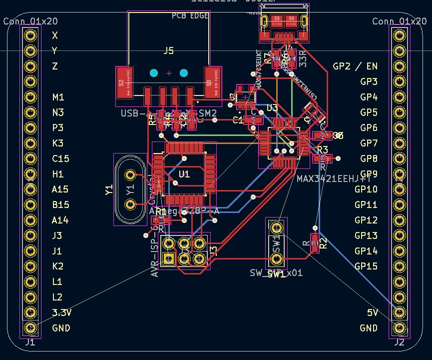

# glitcher-facedancer

This is a MAX3421 USB addon for [glitcher](https://github.com/createremotethread/glitcher). This is similar in functionality to [facewhisperer](https://github.com/scanlime/facewhisperer) and [facedancer](https://github.com/greatscottgadgets/Facedancer).

The critical improvement is the ability to power cycle the target (MAX4793EUK, 300mA limit) and an on-board microcontroller for experiment automation.
